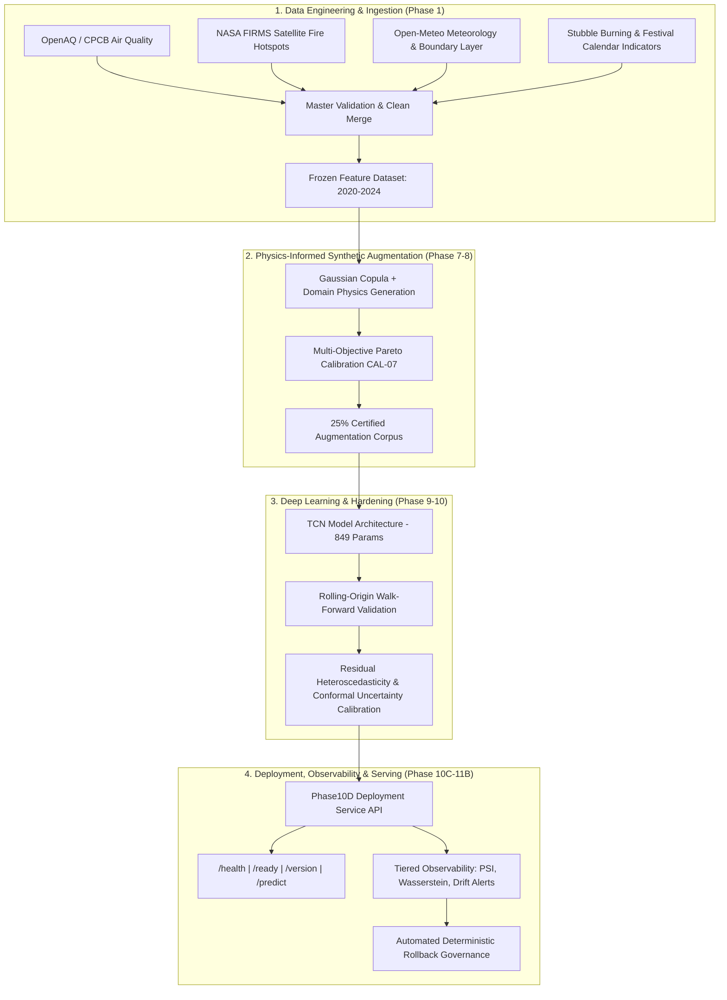

# AtmosIQ: Delhi NCR Atmospheric PM2.5 Forecasting & Policy Intelligence Platform

[](file:///home/suraj/atmosIQ/release/v1.0.0/RELEASE.md)
[](file:///home/suraj/atmosIQ/docs/phase10/phase10e_certification.md)
[-teal.svg)](file:///home/suraj/atmosIQ/ml/src/modeling/phase9/models.py)
[](file:///home/suraj/atmosIQ/ml/experiments/phase8d_calibration/)
[](file:///home/suraj/atmosIQ/ml/tests/)
[](file:///home/suraj/atmosIQ/venv/)
[](file:///home/suraj/atmosIQ/spring-backend/)

---

## 1. Executive Summary & Certified Production Release

**AtmosIQ** is a research-grade, production-certified atmospheric PM2.5 deep-learning forecasting system for the National Capital Region (NCR) of Delhi.

AtmosIQ has achieved **`FINAL_PRODUCTION_CERTIFIED`** status at **Release v1.0.0** following rigorous walk-forward temporal validation, physics-informed synthetic augmentation calibration, runtime chaos hardening, observability governance, and independent master audit certification.

### Certified Release Specifications (v1.0.0):

| Property | Certified Value |
| :--- | :--- |
| **Release ID** | `AtmosIQ_DL_TCN_CAL07_25_PRODUCTION_v1.0.0` |
| **Git Release Tag** | [`v1.0.0`](file:///home/suraj/atmosIQ/release/v1.0.0/RELEASE.md) |
| **Architecture** | Temporal Convolutional Network (TCN) — Dilations [1, 2, 4], Causal 1D Convolutions |
| **Parameter Count** | **849 parameters** |
| **Sequence Window** | $W = 14$ days |
| **Feature Dimension** | $D = 35$ prediction-safe meteorological, pollutant, satellite fire, and chemical features |
| **Production Augmentation** | 25% CAL-07 Physics-Calibrated Synthetic Data (100% synthetic training strictly prohibited) |
| **Model Checkpoint SHA-256** | `fdc99f7ca4410f3d577e52718e35c956c97f368cd91a8b7f505ee23824085bac` |
| **Runtime Calibration Offset** | $-5.06\text{ }\mu\text{g/m}^3$ |
| **Conformal Prediction Bounds** | $90\%$ Interval: $\pm 95.66\text{ }\mu\text{g/m}^3$ (Observed Empirical Coverage: $93.17\%$) |
| **Single Inference Latency** | **0.02 ms** (raw model) / **2.68 ms** (full API service) vs SLA $< 10.0\text{ ms}$ |
| **Batch Pipeline Latency** | **1.49 ms** vs SLA $< 50.0\text{ ms}$ |
| **Memory Footprint** | **44.2 MB** vs SLA $< 256.0\text{ MB}$ |
| **Automated Fallback Target** | `MODEL_V3_PRODUCTION` |

---

## 2. High-Level System Architecture



---

## 3. End-to-End Development & Certification Lineage

```
Phase 1:  Data Engineering & Ingestion Pipeline (OpenAQ, FIRMS, Open-Meteo, Calendar)
Phase 2:  Engineered Feature Matrix Pipeline (256 Raw Candidate Features)
Phase 3:  Tree-Based Baseline Models & SHAP Attribution (XGBoost, LightGBM, Random Forest)
Phase 4:  Prediction-Safe Feature Registry Hardening (35 Leakage-Free Features)
Phase 5:  Conformal Uncertainty Quantification & Bias Calibration
Phase 6:  Decision Support Rules Engine & Phase 6F Upstream Baseline Freeze (21 Artifacts)
Phase 7:  Atmospheric Domain Science & Physics Validation Framework
Phase 8:  Gaussian Copula Synthetic Generation, Multi-Objective Calibration (CAL-07) & Governance
Phase 9:  Deep Learning Architecture Selection (TCN vs LSTM vs GRU vs MLP vs Baselines)
Phase 10: Walk-Forward Production Validation, Runtime Observability, End-to-End Deployment Service
Phase 10E: Master Production Certification Audit Gate (22/22 Gates Passed -> FINAL_PRODUCTION_CERTIFIED)
Phase 11A: Post-Release Smoke Validation & Operational Determinism Verification
Phase 11B: Production Monitoring Baseline & Latency Reconciliation (SLA Verified)
```

---

## 4. Production API Specification

The production serving engine is implemented in [`Phase10DDeploymentService`](file:///home/suraj/atmosIQ/ml/src/modeling/phase10d/deployment.py#L29-L188) and accessed via standard HTTP REST endpoints:

### Endpoints:
- `GET /health` — Service liveness check. Returns `200 OK` `{"status": "HEALTHY", "model_loaded": true}`.
- `GET /ready` — Readiness probe. Returns `200 OK` when scaler, model weights, calibration bias, and conformal uncertainty bounds are loaded.
- `GET /version` — Version endpoint. Returns `200 OK` `{"model_id": "AtmosIQ_DL_TCN_CAL07_25_PRODUCTION_v1.0.0"}`.
- `POST /predict` — Calibrated PM2.5 forecast with $90\%$ conformal uncertainty prediction intervals.

### Request Payload Format:
```json
{
  "records": [
    {
      "pm25_lag_1d": 112.4,
      "pm25_lag_2d": 98.2,
      "pm25_lag_3d": 105.1,
      "pm25_lag_7d": 88.0,
      "pm25_roll_mean_3d": 105.23,
      "temperature_c_lag_1d": 18.5,
      "humidity_pct_lag_1d": 65.0,
      "wind_speed_kmh_lag_1d": 8.2,
      "wind_u_component_1d": -1.2,
      "wind_v_component_1d": 2.4,
      "is_stubble_season": 1,
      "fire_hotspot_count_lag_1d": 342,
      "pblh_1d": 450.0,
      "ventilation_index_1d": 3690.0,
      "aod_550_1d": 0.85,
      "festival_window": 0
    }
  ]
}
```

### Response Payload Format:
```json
{
  "status": "SUCCESS",
  "model_version": "AtmosIQ_DL_TCN_CAL07_25_PRODUCTION_v1.0.0",
  "execution_latency_ms": 1.52,
  "batch_size": 1,
  "forecasts": [
    {
      "prediction_id": "a7f39b12e094c8d1",
      "timestamp_utc": "2026-08-22T00:00:00Z",
      "forecast_pm25": 118.42,
      "lower_90": 22.76,
      "upper_90": 214.08,
      "conformal_half_width": 95.66
    }
  ]
}
```

---

## 5. Quick Start & Verification Workflow

### 1. Environment Setup
```bash
# Clone repository
git clone git@github.com:Suraj-codes1410/AtmosIQ.git
cd AtmosIQ

# Setup Python virtual environment
python3 -m venv venv
source venv/bin/activate
pip install -r ml/requirements.txt
```

### 2. Run Complete Repository Test Suite (360 Tests)
```bash
pytest ml/tests/ -v
```
*Result:* **`360 passed, 0 failed`** across all unit, feature, model, uncertainty, deployment, observability, smoke, and monitoring suites.

### 3. Run Post-Release Smoke Validation (Phase 11A)
```bash
python run_phase11a.py
```
*Result:* Validates release identity, model SHA, 34 protected artifacts, clean load, API endpoints, determinism ($\Delta = 0.00\text{e}+00$), contract rejection, and SLAs.

### 4. Run Operational Monitoring Baseline (Phase 11B)
```bash
python run_phase11b.py
```
*Result:* Generates operational latency decomposition, input quality audits, PSI feature/prediction drift profiles, residual calibration checks, and alert policy verification.

---

## 6. Monorepo Structure

```
atmosIQ/
├── docs/                                  # Platform technical documentation
│   ├── architecture.md                    # System architecture specification
│   ├── phase10/                           # Production validation & certification specs
│   │   ├── phase10_production_validation.md
│   │   ├── phase10b_observability.md
│   │   ├── phase10c_inference.md
│   │   ├── phase10d_release.md
│   │   └── phase10e_certification.md
│   ├── phase11/                           # Post-release operational validation specs
│   │   ├── phase11a_smoke_validation.md
│   │   └── phase11b_monitoring.md
│   └── releases/
│       └── ARTIFACT_COUNT_RECONCILIATION.md
├── release/
│   └── v1.0.0/
│       └── RELEASE.md                     # Immutable v1.0.0 production release document
├── ml/                                    # Machine Learning subsystem
│   ├── src/modeling/
│   │   ├── phase9/                        # Deep learning model architectures (TCN, LSTM, GRU, MLP)
│   │   ├── phase10b/                      # Observability, drift monitoring & alert engine
│   │   ├── phase10d/                      # Production deployment service & governance
│   │   ├── phase10e/                      # Master certification & audit auditor
│   │   ├── phase11a/                      # Post-release smoke validation engine
│   │   └── phase11b/                      # Operational monitoring baseline engine
│   ├── experiments/
│   │   ├── phase10d_release/              # Certified release bundle, manifests & figures
│   │   ├── phase10e_certification/        # 22/22 master certification gate audit evidence
│   │   ├── phase11a_post_release/         # Post-release smoke test results & manifest
│   │   └── phase11b_monitoring/           # Operational monitoring baseline data, figures & reports
│   └── tests/                             # Comprehensive test suite (360 tests)
├── spring-backend/                        # Spring Boot 3.3 (Java 21) orchestration backend
├── fastapi/                               # FastAPI inference microservice wrapper
├── run_phase11a.py                        # Phase 11A CLI launcher
├── run_phase11b.py                        # Phase 11B CLI launcher
└── README.md                              # Main platform guide
```

---

## 7. Known Model Limitations & Operating Boundaries

The following known empirical weaknesses are formally documented as part of the certified baseline:

1. **Winter Stagnation Regime (Dec–Jan)**: Boundary layer collapse ($< 300\text{ m}$) and surface temperature inversions lead to a negative prediction bias ($\approx -8.1\text{ }\mu\text{g/m}^3$) and elevated MAE ($\approx 42.1\text{ }\mu\text{g/m}^3$).
2. **Post-Monsoon Transition Regime (Oct–Nov)**: Rapid meteorological shifts and stubble burning episodes exhibit elevated MAE ($\approx 44.8\text{ }\mu\text{g/m}^3$).
3. **Emergency Pollution Spikes ($> 250\text{ }\mu\text{g/m}^3$)**: Sharp episodic spikes tend to be under-forecast due to historical sparsity in training distributions.
4. **Heightened Operator Monitoring**: Heightened operational surveillance is mandated during severe/emergency air quality episodes.

---

## 8. Scientific Language Safeguards

- `SYNTHETIC DATA != OBSERVED DATA`
- `PHYSICS-INFORMED != PHYSICALLY EXACT`
- `STATISTICAL FIDELITY != CAUSAL VALIDATION`
- `ML UTILITY != SCIENTIFIC TRUTH`
- `PREDICTION INTERVAL != GUARANTEED PHYSICAL UNCERTAINTY`
- `PRODUCTION CERTIFICATION != PROOF OF ATMOSPHERIC CAUSALITY`

---

## 9. License & Governance

AtmosIQ is released for research, operational forecasting, and environmental policy support. Model artifacts and code are governed by strict non-destructive invariance rules. Any future model iteration must be versioned as `v1.1.0` or `v2.0.0` without mutating the certified `v1.0.0` baseline.
