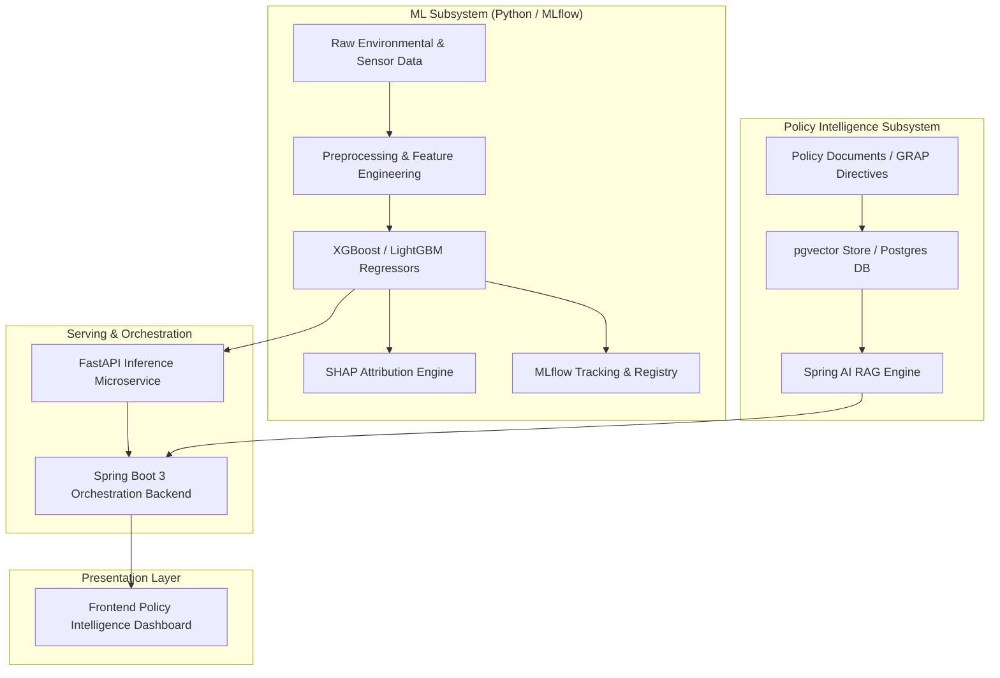

# atmosIQ: Delhi AQI Source-Signal Attribution & Policy Intelligence Platform


## Overview & Platform Goals

**atmosIQ** is a production-grade AI platform built to deliver precise **PM2.5 source-signal attribution** and **policy impact intelligence** for the National Capital Region (NCR) of Delhi.

### What atmosIQ Is NOT:
- atmosIQ is **NOT** a simple AQI forecasting chatbot.

### Core Objectives:
1. **Machine Learning Attribution**: Train custom ML regression models (XGBoost, LightGBM) to predict PM2.5 concentrations based on environmental, meteorological, and anthropogenic feature groups.
2. **Explainable AI (SHAP)**: Calculate exact Shapley additive feature-group attributions (TreeSHAP) to decompose PM2.5 levels into actionable source signals:
   - Vehicular traffic density
   - Industrial emissions
   - Agricultural stubble burning fire counts
   - Regional atmospheric boundary layer dynamics
3. **Spring AI & Policy RAG Orchestration**: Orchestrate predictions and SHAP attributions with clean air policy documents (GRAP, NCAP) using Spring AI, FastAPI, and PostgreSQL with `pgvector` semantic vector store.

---

## High-Level System Architecture



Detailed architecture specifications are available in [`docs/architecture.md`](file:///home/suraj/atmosIQ/docs/architecture.md).

---

## Monorepo Folder Structure

```
atmosIQ/
├── docs/                     # Architectural specs, branching guidelines, setup guides
│   ├── architecture.md
│   ├── branching_strategy.md
│   └── setup_guide.md
├── docker/                   # Docker service configs and DB initialization
│   ├── mlflow/               # MLflow server container configs
│   └── postgres/             # init.sql script with pgvector extension setup
├── ml/                       # Machine Learning subsystem
│   ├── data/                 # Data directory structure
│   │   ├── raw/              # Immutable raw ingested datasets
│   │   ├── processed/        # Feature-engineered training arrays
│   │   └── external/         # External GIS and satellite feeds
│   ├── notebooks/            # Exploratory data analysis & SHAP research notebooks
│   ├── src/                  # Production python ML package
│   │   ├── ingestion/        # Sensor & meteorology API ingestion drivers
│   │   ├── preprocessing/    # Data cleaning and feature transformers
│   │   ├── training/         # Model training & cross-validation pipelines
│   │   ├── explainability/   # TreeSHAP & feature-group attribution algorithms
│   │   ├── optimization/     # Optuna hyperparameter optimization scripts
│   │   └── utils/            # Helper utilities and data loaders
│   ├── models/               # Model artifact storage
│   ├── configs/              # Model YAML configs & Python config.py
│   ├── tests/                # ML unit & sanity tests
│   ├── requirements.txt      # Python dependencies
│   └── config.py             # ML configuration module
├── fastapi/                  # FastAPI inference microservice (Phase 1+)
├── spring-backend/           # Spring Boot 3 (Java 21) orchestration backend
│   ├── pom.xml               # Maven configuration with Spring AI, JPA, pgvector
│   └── src/
│       ├── main/
│       │   ├── java/com/atmosiq/AtmosIQApplication.java
│       │   └── resources/application.yml
│       └── test/
├── frontend/                 # Web dashboard UI (Phase 1+)
├── rag/                      # Policy document & vector embedding store
│   ├── documents/            # Policy PDFs & NCAP guidelines
│   └── embeddings/           # Vector embeddings cache
├── scripts/                  # Automation scripts
│   ├── setup_env.sh          # Virtual environment setup script
│   └── start_infrastructure.sh# Docker compose infrastructure launcher
├── docker-compose.yml        # Docker compose for PostgreSQL, pgAdmin, MLflow
├── .env.example              # Environment variables template
├── .gitignore                # Git ignore rule definitions
└── README.md                 # Project README
```

---

## Development Workflow

### 1. Prerequisites
- **Docker** & **Docker Compose**
- **Java 21 JDK** & **Maven 3.9+**
- **Python 3.10+**

### 2. Environment Setup
```bash
# Clone and setup environment
cp .env.example .env

# Start infrastructure (PostgreSQL, pgAdmin, MLflow)
./scripts/start_infrastructure.sh

# Setup Python virtual environment
./scripts/setup_env.sh
source venv/bin/activate
```

### 3. Verification & Testing

#### Test Python Environment:
```bash
source venv/bin/activate
pytest ml/tests/
```

#### Test Spring Boot Backend:
```bash
cd spring-backend
mvn compile
mvn test
```

---

## Git & Branching Strategy

We enforce a strict GitFlow feature-branch strategy with Conventional Commits.

### Branch Naming
- `main`: Production releases (`v0.1.0`, etc.)
- `develop`: Integration branch
- `feature/<subsystem>/<name>`: New features (e.g. `feature/ml/shap-attribution`)
- `bugfix/<subsystem>/<issue-id>`: Bug fixes
- `hotfix/<description>`: Production hotfixes

### Commit Convention
Format: `<type>(<scope>): <short summary>`
- `feat`: New feature
- `fix`: Bug fix
- `chore`: Infrastructure/scaffolding setup
- `docs`: Documentation updates

For full branching guidelines, refer to [`docs/branching_strategy.md`](file:///home/suraj/atmosIQ/docs/branching_strategy.md).

---

## Infrastructure Services Matrix

| Service | Port | Description | Access / URL |
|---|---|---|---|
| **PostgreSQL + pgvector** | `5432` | Relational & Vector DB | `localhost:5432` (db: `atmosiq_db`) |
| **pgAdmin 4** | `5050` | Database Admin GUI | `http://localhost:5050` (`admin@atmosiq.com` / `admin`) |
| **MLflow Server** | `5000` | Experiment & Model Tracking | `http://localhost:5000` |
| **Spring Boot Backend** | `8080` | Orchestration Engine | `http://localhost:8080/actuator/health` |

---

## Phase 0 Status & Next Steps

Phase 0 completed successfully:
- [x] Monorepo folder structure initialized.
- [x] Docker Compose configured for PostgreSQL (`pgvector`), pgAdmin, MLflow.
- [x] Maven Spring Boot 3.3 (Java 21) dependency setup completed.
- [x] Python environment (`requirements.txt`, `venv`, `config.py`) validated.
- [x] Complete documentation & branching guidelines created.
- [x] Zero ML model code, zero business logic, zero FastAPI endpoints (clean Phase 0 scaffold).
