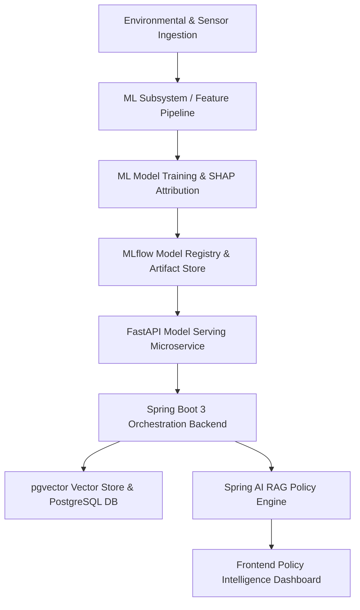

# atmosIQ System Architecture Specification

## Overview

**atmosIQ** (Delhi AQI Source-Signal Attribution & Policy Intelligence Platform) is an enterprise-grade AI system designed for real-time PM2.5 prediction, explainable source-signal attribution using SHAP (SHapley Additive exPlanations), and policy impact intelligence.

Unlike conventional forecasting chatbots, atmosIQ quantifies the precise contribution of key environmental and human emission factors (e.g. stubble burning, vehicular emissions, industrial discharge, atmospheric boundary layer dynamics) to PM2.5 levels.

## Subsystem Architecture

### 1. Machine Learning Core (`ml/`)
- **Models**: Gradient Boosted Trees (XGBoost, LightGBM) tuned via Optuna.
- **Explainability**: TreeSHAP feature-group attribution for source signal decomposition.
- **Tracking & Governance**: MLflow for experiment tracking, metric logging, and artifact management.

### 2. Microservice Layer (`fastapi/`)
- High-throughput REST API layer for low-latency model inference and SHAP calculation.

### 3. Orchestration Backend (`spring-backend/`)
- Spring Boot 3.3 (Java 21) backend service.
- Manages business workflows, user sessions, data persistence via JPA/Hibernate, and Spring AI orchestration.

### 4. Knowledge Retrieval & RAG (`rag/` & `spring-backend/`)
- Document store containing Delhi clean air policies, NCAP (National Clean Air Programme) directives, and GRAP (Graded Response Action Plan) guidelines.
- Vector database powered by **PostgreSQL + pgvector** for semantic search and policy analysis.

### 5. Frontend UI (`frontend/`)
- Web dashboard providing interactive visualizations for attribution breakdowns, scenario simulations, and policy insights.
