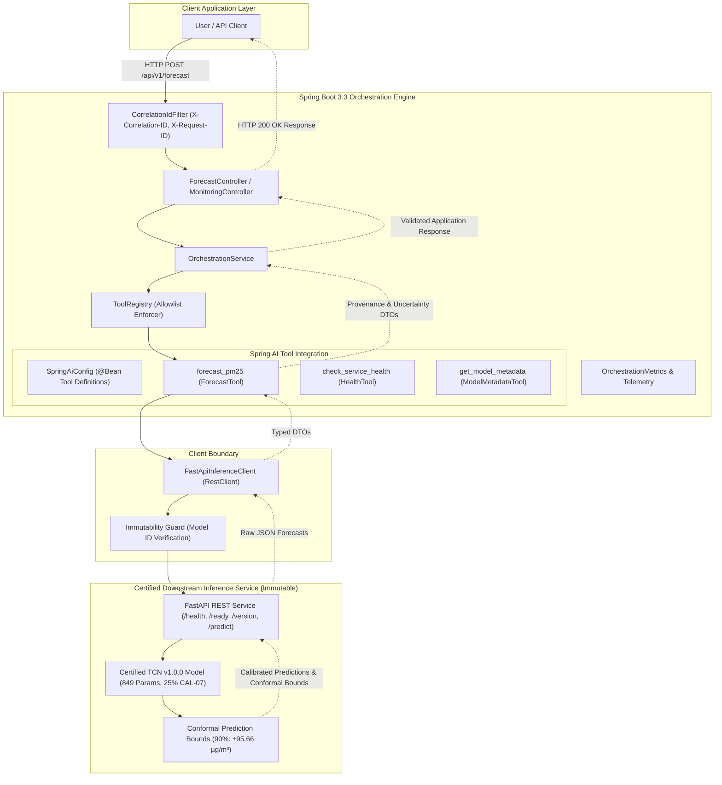

# AtmosIQ Phase 12 — Architecture Specification: Spring Boot + Spring AI Orchestration Foundation

## 1. Overview & System Topology

Phase 12 establishes the application orchestration layer for AtmosIQ on top of the certified **AtmosIQ v1.0.0** forecasting system.

The orchestration foundation integrates **Spring Boot 3.3 (Java 21)** and **Spring AI** with strongly typed tool contracts, client boundaries, provenance propagation, and strict tool allowlisting.

---

## 2. Core Architectural Roles

- **Spring Boot**: Hosts application REST controllers, global exception handling, correlation ID tracking, metrics, and application DTOs.
- **Spring AI**: Exposes structured function-calling tool contracts (`forecast_pm25`, `check_service_health`, `get_model_metadata`) with documented JSON schemas.
- **FastAPI Client**: Handles HTTP communication to the certified inference microservice with timeouts and error mapping.
- **TCN v1.0.0**: The certified downstream deep learning model (849 parameters, $W=14, D=35$). The ML model and weights remain 100% frozen and immutable.
