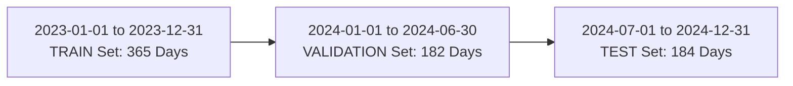

# AtmosIQ Phase 3A: Temporal Split Protocol

## 1. Chronological Splitting Strategy

In environmental time-series modeling, random K-Fold cross-validation or `train_test_split` causes severe autocorrelation leakage. To evaluate models under realistic operational conditions, AtmosIQ enforces a **strict chronological temporal split**.

---

## 2. Split Partition Boundaries & Row Counts

| Split Partition | Start Date | End Date | Row Count | Purpose |
|---|---|---|---|---|
| **TRAIN** | 2023-01-01 | 2023-12-31 | **365** | Model training & parameter estimation |
| **VALIDATION** | 2024-01-01 | 2024-06-30 | **182** | Hyperparameter tuning & model selection |
| **TEST** | 2024-07-01 | 2024-12-31 | **184** | Out-of-sample final evaluation |
| **TOTAL** | **2023-01-01** | **2024-12-31** | **731** | Complete 2-year snapshot |

---

## 3. Split Integrity & Disjointness Verification

The temporal splits satisfy 3 strict mathematical properties:
1. **Monotonic Order**: $\max(\text{Train}_{\text{date}}) < \min(\text{Val}_{\text{date}})$ and $\max(\text{Val}_{\text{date}}) < \min(\text{Test}_{\text{date}})$.
2. **Disjointness**: $\text{Train} \cap \text{Val} = \emptyset$, $\text{Train} \cap \text{Test} = \emptyset$, $\text{Val} \cap \text{Test} = \emptyset$.
3. **Partition Completeness**: $N_{\text{Train}} + N_{\text{Val}} + N_{\text{Test}} = 731$.

---

## 4. Timeline Plot Visualization

The chronological split visualization is generated at [`ml/data/modeling/v1/plots/pm25_temporal_split.png`](file:///home/suraj/atmosIQ/ml/data/modeling/v1/plots/pm25_temporal_split.png).
