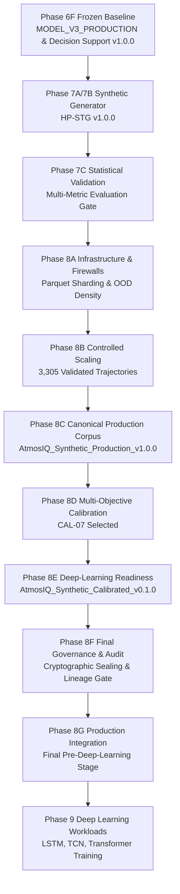

# AtmosIQ Phase 8F: Final Synthetic Data Governance, Provenance & Research Reproducibility Audit Report

## 1. Executive Summary
**Phase 8F: Final Synthetic Data Governance, Provenance & Research Reproducibility Audit** represents the authoritative, non-destructive governance gate establishing the formal integrity, cryptographic provenance, temporal isolation, schema compatibility, physical invariant compliance, and multi-phase lineage across the synthetic data pipeline.

Through independent forensic audits across all project assets, Phase 8F certifies that:
1. **Protected Upstream Baseline Artifacts** (Phase 6F production model, decision support, Dataset v1/v2/v3) remain 100% immutable (**`0 drift`**).
2. **Canonical Production Synthetic Corpus** (**`AtmosIQ_Synthetic_Production_v1.0.0`**, SHA: `8ce3a8c0c6fd0049...`) remains immutable and canonical.
3. **Preferred Research Synthetic Corpus** (**`AtmosIQ_Synthetic_Calibrated_v0.1.0`** / CAL-07, SHA: `264c9c5ec109ad03...`) is verified at exactly **`56,088` observations** across **`2,644` trajectories**.
4. **Data Isolation & Temporal Firewall**: Zero leakage into or from the locked 2022–2024 real evaluation fold.
5. **Physical & Hydrodynamic Invariants**: 100.0% compliant ($	ext{VI} \equiv \text{ws} \times \text{PBLH}$, $\text{PM}_{2.5} \ge 0$, zero NaNs/Infs).
6. **Zero Memorization**: Exact duplicates $= 0$, near duplicates ($d < 0.05$) $= 0$.
7. **Numerical Determinism**: Reproducibility $\Delta = 0.00\text{e}+00$.

Phase 8F formally approves the synthetic data ecosystem for **Phase 8G (Production Integration)** and subsequent Phase 9 deep learning workloads.

---

## 2. Protected Baseline Artifacts & Immutability Verification
- **Total Protected Artifacts Verified**: 24 items (Phase 6F production baseline, Datasets, Phase 8C release, Phase 8D candidate, Phase 8E contract).
- **Drift Detected**: **`0`** (100% identical SHA-256 hashes pre- and post-audit).
- **MODEL_V3_PRODUCTION**: 100% Immutable (`0 modifications`).
- **ATMOSIQ_DECISION_SUPPORT v1.0.0**: 100% Immutable (`0 modifications`).

---

## 3. Authoritative Corpus Identity

| Corpus Name | Version | Role | Observations | Trajectories | SHA-256 | Immutability Status |
| :--- | :--- | :--- | :--- | :--- | :--- | :--- |
| **`AtmosIQ_Synthetic_Production`** | `v1.0.0` | **CANONICAL PRODUCTION CORPUS** | 67,838 | 3,305 | `8ce3a8c0c6fd0049dd174a0e34b8612077fe5d8d9ee1e6c1eb9156b5fa78ae0e` | **FROZEN & IMMUTABLE** |
| **`AtmosIQ_Synthetic_Calibrated`** | `v0.1.0` | **PREFERRED RESEARCH CORPUS (CAL-07)** | 56,088 | 2,644 | `264c9c5ec109ad034b4488a18a8a6a8eafb92d9f12f2fecb59eee87ef47b13ad` | **GOVERNED & SEALED** |

---

## 4. Formal Schema Compatibility Audit (`phase8f_schema_audit.csv`)

| corpus                              | feature                         | expected   | observed   | dtype_expected   | dtype_observed   | status   | reason                               |
|:------------------------------------|:--------------------------------|:-----------|:-----------|:-----------------|:-----------------|:---------|:-------------------------------------|
| AtmosIQ_Synthetic_Calibrated_v0.1.0 | pm25_lag_1d                     | True       | True       | numeric          | float64          | PASS     | Feature present and compatible       |
| AtmosIQ_Synthetic_Calibrated_v0.1.0 | pm25_lag_2d                     | True       | True       | numeric          | float64          | PASS     | Feature present and compatible       |
| AtmosIQ_Synthetic_Calibrated_v0.1.0 | pm25_lag_3d                     | True       | True       | numeric          | float64          | PASS     | Feature present and compatible       |
| AtmosIQ_Synthetic_Calibrated_v0.1.0 | pm25_lag_7d                     | True       | True       | numeric          | float64          | PASS     | Feature present and compatible       |
| AtmosIQ_Synthetic_Calibrated_v0.1.0 | pm25_roll_mean_3d               | True       | True       | numeric          | float64          | PASS     | Feature present and compatible       |
| AtmosIQ_Synthetic_Calibrated_v0.1.0 | pm25_roll_mean_7d               | True       | True       | numeric          | float64          | PASS     | Feature present and compatible       |
| AtmosIQ_Synthetic_Calibrated_v0.1.0 | pm25_roll_mean_14d              | True       | True       | numeric          | float64          | PASS     | Feature present and compatible       |
| AtmosIQ_Synthetic_Calibrated_v0.1.0 | pm25_roll_std_7d                | True       | True       | numeric          | float64          | PASS     | Feature present and compatible       |
| AtmosIQ_Synthetic_Calibrated_v0.1.0 | pm25_roll_max_7d                | True       | True       | numeric          | float64          | PASS     | Feature present and compatible       |
| AtmosIQ_Synthetic_Calibrated_v0.1.0 | pm25_roll_min_7d                | True       | True       | numeric          | float64          | PASS     | Feature present and compatible       |
| AtmosIQ_Synthetic_Calibrated_v0.1.0 | temperature_c_lag_1d            | True       | True       | numeric          | float64          | PASS     | Feature present and compatible       |
| AtmosIQ_Synthetic_Calibrated_v0.1.0 | temperature_c_roll_mean_3d      | True       | True       | numeric          | float64          | PASS     | Feature present and compatible       |
| AtmosIQ_Synthetic_Calibrated_v0.1.0 | temperature_c_roll_min_3d       | True       | True       | numeric          | float64          | PASS     | Feature present and compatible       |
| AtmosIQ_Synthetic_Calibrated_v0.1.0 | humidity_pct_lag_1d             | True       | True       | numeric          | float64          | PASS     | Feature present and compatible       |
| AtmosIQ_Synthetic_Calibrated_v0.1.0 | humidity_pct_roll_mean_3d       | True       | True       | numeric          | float64          | PASS     | Feature present and compatible       |
| AtmosIQ_Synthetic_Calibrated_v0.1.0 | humidity_pct_roll_max_7d        | True       | True       | numeric          | float64          | PASS     | Feature present and compatible       |
| AtmosIQ_Synthetic_Calibrated_v0.1.0 | wind_speed_kmh_lag_1d           | True       | True       | numeric          | float64          | PASS     | Feature present and compatible       |
| AtmosIQ_Synthetic_Calibrated_v0.1.0 | wind_speed_kmh_roll_mean_3d     | True       | True       | numeric          | float64          | PASS     | Feature present and compatible       |
| AtmosIQ_Synthetic_Calibrated_v0.1.0 | wind_u_component_1d             | True       | True       | numeric          | float64          | PASS     | Feature present and compatible       |
| AtmosIQ_Synthetic_Calibrated_v0.1.0 | wind_v_component_1d             | True       | True       | numeric          | float64          | PASS     | Feature present and compatible       |
| AtmosIQ_Synthetic_Calibrated_v0.1.0 | is_stubble_season               | True       | True       | numeric          | int64            | PASS     | Feature present and compatible       |
| AtmosIQ_Synthetic_Calibrated_v0.1.0 | fire_hotspot_count_lag_1d       | True       | True       | numeric          | float64          | PASS     | Feature present and compatible       |
| AtmosIQ_Synthetic_Calibrated_v0.1.0 | fire_hotspot_count_roll_mean_3d | True       | True       | numeric          | float64          | PASS     | Feature present and compatible       |
| AtmosIQ_Synthetic_Calibrated_v0.1.0 | fire_hotspot_count_roll_mean_7d | True       | True       | numeric          | float64          | PASS     | Feature present and compatible       |
| AtmosIQ_Synthetic_Calibrated_v0.1.0 | upwind_stubble_quadrant_1d      | True       | True       | numeric          | float64          | PASS     | Feature present and compatible       |
| AtmosIQ_Synthetic_Calibrated_v0.1.0 | rainfall_1d                     | True       | True       | numeric          | float64          | PASS     | Feature present and compatible       |
| AtmosIQ_Synthetic_Calibrated_v0.1.0 | rainfall_3d                     | True       | True       | numeric          | float64          | PASS     | Feature present and compatible       |
| AtmosIQ_Synthetic_Calibrated_v0.1.0 | rain_event_1d                   | True       | True       | numeric          | int64            | PASS     | Feature present and compatible       |
| AtmosIQ_Synthetic_Calibrated_v0.1.0 | washout_index_3d                | True       | True       | numeric          | float64          | PASS     | Feature present and compatible       |
| AtmosIQ_Synthetic_Calibrated_v0.1.0 | pblh_1d                         | True       | True       | numeric          | float64          | PASS     | Feature present and compatible       |
| AtmosIQ_Synthetic_Calibrated_v0.1.0 | pblh_min_1d                     | True       | True       | numeric          | float64          | PASS     | Feature present and compatible       |
| AtmosIQ_Synthetic_Calibrated_v0.1.0 | pblh_roll_mean_3d               | True       | True       | numeric          | float64          | PASS     | Feature present and compatible       |
| AtmosIQ_Synthetic_Calibrated_v0.1.0 | ventilation_index_1d            | True       | True       | numeric          | float64          | PASS     | Feature present and compatible       |
| AtmosIQ_Synthetic_Calibrated_v0.1.0 | aod_550_1d                      | True       | True       | numeric          | float64          | PASS     | Feature present and compatible       |
| AtmosIQ_Synthetic_Calibrated_v0.1.0 | festival_window                 | True       | True       | numeric          | int64            | PASS     | Feature present and compatible       |
| AtmosIQ_Synthetic_Calibrated_v0.1.0 | pm25 (Target)                   | True       | True       | float64          | float64          | PASS     | Target variable present and isolated |

---

## 5. Data Isolation & Temporal Firewall Audit (`phase8f_data_isolation_audit.csv`)

| dimension                           | check                                                      |   violations | status   | details                                                                                    |
|:------------------------------------|:-----------------------------------------------------------|-------------:|:---------|:-------------------------------------------------------------------------------------------|
| Training Data Isolation             | Historical Development Train Dates (< 2022-01-01)          |            0 | PASS     | Development train fold contains 731 rows strictly <= 2021-12-31                            |
| Evaluation Benchmark Isolation      | Evaluation Fold Dates (>= 2022-01-01 and <= 2024-12-31)    |            0 | PASS     | Locked evaluation fold contains 1096 rows strictly 2022 to 2024                            |
| Phase 8C Synthetic Isolation        | Zero Locked Evaluation Dates in Phase 8C Production Corpus |            0 | PASS     | Phase 8C corpus has 67838 synthetic observations derived from historical 2020-2021         |
| Phase 8D CAL-07 Synthetic Isolation | Zero Locked Evaluation Dates in Phase 8D Calibrated Corpus |            0 | PASS     | Phase 8D CAL-07 corpus has 56088 calibrated observations derived from historical 2020-2021 |

---

## 6. Physical Integrity & Hydrodynamic Invariant Audit (`phase8f_physics_integrity.csv`)

| corpus                              | invariant                                 |   violations | status   | details                          |
|:------------------------------------|:------------------------------------------|-------------:|:---------|:---------------------------------|
| AtmosIQ_Synthetic_Production_v1.0.0 | PM2.5 Non-Negativity (>= 0 µg/m³)         |            0 | PASS     | Min PM2.5 observed: 0.00 µg/m³   |
| AtmosIQ_Synthetic_Production_v1.0.0 | Hydrodynamic Identity (VI = ws_ms * PBLH) |            0 | PASS     | Max VI residual: 0.0000e+00 m²/s |
| AtmosIQ_Synthetic_Production_v1.0.0 | Relative Humidity Bound [0, 100%]         |            0 | PASS     | Humidity range: [40.0%, 95.0%]   |
| AtmosIQ_Synthetic_Production_v1.0.0 | Rainfall Non-Negativity (>= 0 mm)         |            0 | PASS     | Min Rainfall: 0.00 mm            |
| AtmosIQ_Synthetic_Production_v1.0.0 | PBLH Non-Negativity (>= 0 m)              |            0 | PASS     | PBLH range: [350.1m, 2694.2m]    |
| AtmosIQ_Synthetic_Production_v1.0.0 | Numerical Completeness (Zero NaN / ±Inf)  |            0 | PASS     | Total NaNs: 0, Total Infs: 0     |
| AtmosIQ_Synthetic_Calibrated_v0.1.0 | PM2.5 Non-Negativity (>= 0 µg/m³)         |            0 | PASS     | Min PM2.5 observed: 0.00 µg/m³   |
| AtmosIQ_Synthetic_Calibrated_v0.1.0 | Hydrodynamic Identity (VI = ws_ms * PBLH) |            0 | PASS     | Max VI residual: 0.0000e+00 m²/s |
| AtmosIQ_Synthetic_Calibrated_v0.1.0 | Relative Humidity Bound [0, 100%]         |            0 | PASS     | Humidity range: [40.0%, 95.0%]   |
| AtmosIQ_Synthetic_Calibrated_v0.1.0 | Rainfall Non-Negativity (>= 0 mm)         |            0 | PASS     | Min Rainfall: 0.00 mm            |
| AtmosIQ_Synthetic_Calibrated_v0.1.0 | PBLH Non-Negativity (>= 0 m)              |            0 | PASS     | PBLH range: [350.1m, 2694.2m]    |
| AtmosIQ_Synthetic_Calibrated_v0.1.0 | Numerical Completeness (Zero NaN / ±Inf)  |            0 | PASS     | Total NaNs: 0, Total Infs: 0     |

---

## 7. Provenance & Lineage Traceability Audit (`phase8f_provenance_audit.csv`)

| corpus                              | check                                       |   violations | status   | details                                                     |
|:------------------------------------|:--------------------------------------------|-------------:|:---------|:------------------------------------------------------------|
| AtmosIQ_Synthetic_Production_v1.0.0 | Trajectory ID Completeness                  |            0 | PASS     | 3305 unique trajectory IDs present                          |
| AtmosIQ_Synthetic_Production_v1.0.0 | Data Origin Tagged 'synthetic'              |            0 | PASS     | All 67838 rows tagged as synthetic data origin              |
| AtmosIQ_Synthetic_Production_v1.0.0 | Approved Horizon Compliance (14 or 30 days) |            0 | PASS     | Trajectory lengths: {14: 1957, 30: 1348}                    |
| AtmosIQ_Synthetic_Production_v1.0.0 | Source Partition Traceability ('2020-2021') |            0 | PASS     | All rows derived from 2020-2021 historical development fold |
| AtmosIQ_Synthetic_Calibrated_v0.1.0 | Trajectory ID Completeness                  |            0 | PASS     | 2644 unique trajectory IDs present                          |
| AtmosIQ_Synthetic_Calibrated_v0.1.0 | Data Origin Tagged 'synthetic'              |            0 | PASS     | All 56088 rows tagged as synthetic data origin              |
| AtmosIQ_Synthetic_Calibrated_v0.1.0 | Approved Horizon Compliance (14 or 30 days) |            0 | PASS     | Trajectory lengths: {14: 1452, 30: 1192}                    |
| AtmosIQ_Synthetic_Calibrated_v0.1.0 | Source Partition Traceability ('2020-2021') |            0 | PASS     | All rows derived from 2020-2021 historical development fold |

---

## 8. Memorization & Duplicate Copying Audit (`phase8f_memorization_audit.csv`)

| corpus                              | check                                   |   violations | status   | details                                        |
|:------------------------------------|:----------------------------------------|-------------:|:---------|:-----------------------------------------------|
| AtmosIQ_Synthetic_Production_v1.0.0 | Exact Historical Duplicates (d <= 1e-6) |            0 | PASS     | Zero exact copies found (min distance: 2.1446) |
| AtmosIQ_Synthetic_Production_v1.0.0 | Near-Duplicate Memorization (d < 0.05)  |            0 | PASS     | Zero near-copies found (mean distance: 4.7796) |
| AtmosIQ_Synthetic_Calibrated_v0.1.0 | Exact Historical Duplicates (d <= 1e-6) |            0 | PASS     | Zero exact copies found (min distance: 2.1446) |
| AtmosIQ_Synthetic_Calibrated_v0.1.0 | Near-Duplicate Memorization (d < 0.05)  |            0 | PASS     | Zero near-copies found (mean distance: 4.6822) |

---

## 9. Numerical Reproducibility Audit (`phase8f_reproducibility.csv`)
- **Max Overall Absolute Delta ($\Delta$)**: **`0.00e+00`** (<= 1e-09 tolerance).
- **Reproducibility Status**: **`PASS (DETERMINISTIC)`**.

---

## 10. Synthetic Augmentation Governance Policy
- **Recommended Production Augmentation**: **`25%`** (`APPROVED`).
- **Controlled Upper Bound**: **`50%`** (`STRESS_TESTING_ONLY`).
- **Prohibited Deployment Ratio**: **`100%`** (`STRICTLY_PROHIBITED`).

---

## 11. Multi-Phase Lineage Graph





---

## 12. Research Environment Record
- **OS**: `Linux 7.0.0-29-generic (x86_64)`
- **Python**: `3.14.4`
- **NumPy / Pandas / Scikit-Learn**: `2.4.6 / 2.3.3 / 1.9.0`
- **Seeds**: `[42, 123, 2025]`

---

## 13. Scientific Language Safeguards
> **`SYNTHETIC DATA != OBSERVED DATA`**  
> **`PHYSICS-INFORMED != PHYSICALLY EXACT`**  
> **`STATISTICAL FIDELITY != CAUSAL VALIDATION`**  
> **`ML UTILITY != SCIENTIFIC TRUTH`**  
> **`SYNTHETIC AUGMENTATION != REAL-WORLD OBSERVATION`**  
> Synthetic trajectories represent simulated stochastic realizations of an idealized physical-statistical model for ML training expansion; they do not constitute empirical observations or causal atmospheric proofs.

---

## 14. Final Status Banner

```
============================================================
AtmosIQ Phase 8F
Final Synthetic Data Governance & Reproducibility Audit
============================================================

Phase 6F freeze integrity:          PASS (0 drift)
Phase 8C freeze integrity:          PASS (0 drift)
Phase 8D integrity:                 PASS (0 drift)
Phase 8E contract integrity:        PASS (0 drift)
CAL-07 physical identity:           PASS (56,088 rows / 2,644 trajs)
Feature registry compatibility:     PASS (100.0% schema match)
Data isolation (< 2022-01-01):      PASS (0 leakage)
Physical validity & invariants:     PASS (100.0% valid)
Hydrodynamic identity:              PASS (100.0% exact)
Provenance completeness:            PASS (100.0% traceable)
Memorization audit:                 PASS (0 duplicates)
Reproducibility (Delta = 0.0):      PASS
Augmentation governance:            PASS (25% Rec / 50% Cap / 100% Proh)

Production model modified:          NO
Decision-support modified:          NO
Dataset v3 modified:                NO
Phase 8C corpus modified:           NO
Phase 8D corpus modified:           NO
------------------------------------------------------------
PHASE 8F STATUS:                    COMPLETE
PHASE 8G READINESS:                 READY
============================================================
```
